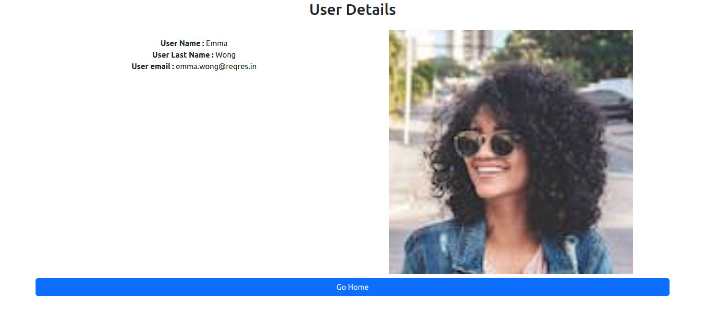

# Angular17ReqresSignal

This project was generated with [Angular CLI](https://github.com/angular/angular-cli) version 17.0.0.



# Ejemplo de respuesta:
```
{
  "page": 1,
  "per_page": 6,
  "total": 12,
  "total_pages": 2,
  "data": [
    {
      "id": 1,
      "email": "george.bluth@reqres.in",
      "first_name": "George",
      "last_name": "Bluth",
      "avatar": "https://reqres.in/img/faces/1-image.jpg"
    },
    {
      "id": 2,
      "email": "janet.weaver@reqres.in",
      "first_name": "Janet",
      "last_name": "Weaver",
      "avatar": "https://reqres.in/img/faces/2-image.jpg"
    },
    {
      "id": 3,
      "email": "emma.wong@reqres.in",
      "first_name": "Emma",
      "last_name": "Wong",
      "avatar": "https://reqres.in/img/faces/3-image.jpg"
    },
    {
      "id": 4,
      "email": "eve.holt@reqres.in",
      "first_name": "Eve",
      "last_name": "Holt",
      "avatar": "https://reqres.in/img/faces/4-image.jpg"
    },
    {
      "id": 5,
      "email": "charles.morris@reqres.in",
      "first_name": "Charles",
      "last_name": "Morris",
      "avatar": "https://reqres.in/img/faces/5-image.jpg"
    },
    {
      "id": 6,
      "email": "tracey.ramos@reqres.in",
      "first_name": "Tracey",
      "last_name": "Ramos",
      "avatar": "https://reqres.in/img/faces/6-image.jpg"
    }
  ],
  "support": {
    "url": "https://reqres.in/#support-heading",
    "text": "To keep ReqRes free, contributions towards server costs are appreciated!"
  }
}
```
## Development server

Run `ng serve` for a dev server. Navigate to `http://localhost:4200/`. The application will automatically reload if you change any of the source files.

## Code scaffolding

Run `ng generate component component-name` to generate a new component. You can also use `ng generate directive|pipe|service|class|guard|interface|enum|module`.

## Build

Run `ng build` to build the project. The build artifacts will be stored in the `dist/` directory.

## Running unit tests

Run `ng test` to execute the unit tests via [Karma](https://karma-runner.github.io).

## Running end-to-end tests

Run `ng e2e` to execute the end-to-end tests via a platform of your choice. To use this command, you need to first add a package that implements end-to-end testing capabilities.

## Further help

To get more help on the Angular CLI use `ng help` or go check out the [Angular CLI Overview and Command Reference](https://angular.io/cli) page.
# angular17-signal-reqres-jp
